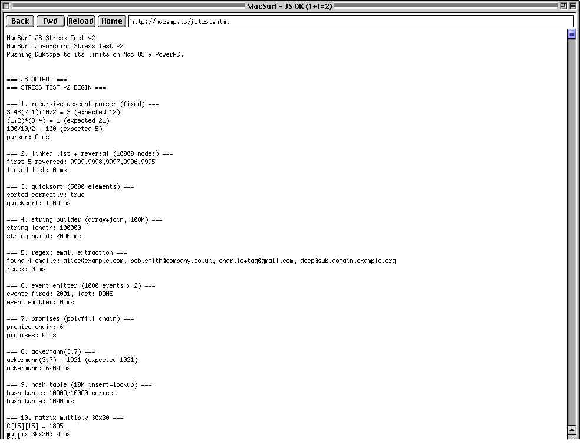

  

  <strong>A modern web browser for Mac OS 9.</strong> 
  Built on the NetSurf engine, paired with a TLS-stripping proxy and an optional native HTTPS library.

   PowerPC G3 / G4 &middot;
  Mac OS 9.1 &ndash; 9.2.2 &middot;
  64&nbsp;MB RAM floor &middot;
  CodeWarrior 8 Pro

---

## What MacSurf is

MacSurf is a port of [NetSurf](https://www.netsurf-browser.org/) to Classic Mac OS 9 on PowerPC, using the Carbon API. It renders real CSS3 (custom properties, flex, grid, gradients, transforms, shadows), runs JavaScript via [Duktape](https://duktape.org/) (ES5), decodes PNG / GIF / JPEG / BMP / TIFF, and fetches over HTTP — with HTTPS handled either by the bundled Go proxy or by macSSL, a sibling project providing native TLS 1.2 straight from the Mac.

## The pieces

| Component | Language | Purpose |
|-----------|----------|---------|
| [`browser/`](browser/) | C (CW8 / C89) | NetSurf fork with a `macos9` frontend. Carbon UI, QuickDraw plotters, Open Transport networking, Duktape JS. |
| [`proxy/`](proxy/) | Go (stdlib only) | TLS-stripping HTTP proxy. Mac sends plain HTTP, proxy fetches via HTTPS. |
| `macSSL` (sibling repo) | C (CW8) | Native TLS 1.2 library — modern HTTPS straight from the Mac, no proxy required. Built on BearSSL. |

## Highlights

<table>
<tr>
<td width="33%" align="center">
   
  <em>Duktape ES5 evaluating live in MacSurf</em>
</td>
<td width="33%" align="center">
   
  <em>Closures, prototypes, regex, JSON, promises &mdash; all on PowerPC</em>
</td>
<td width="33%" align="center">
   
  <em>Mandelbrot rendered by JS on a G3</em>
</td>
</tr>
</table>

## What works today

- **Rendering:** full NetSurf pipeline &mdash; fetch &rarr; parse &rarr; CSS cascade with native `var()` &rarr; layout &rarr; QuickDraw plot.
- **CSS:** custom properties (`var()`), flex layout (`justify-content`, `align-content`, `order`), CSS Grid V1 + `grid-template-columns/rows`, `gap`, `border-radius`, `box-shadow`, linear &amp; radial gradients, `text-shadow`, opacity, `transform` (rotate / translate / scale), z-index stacking contexts, `text-overflow: ellipsis`, CSS counters, viewport units (`vh`, `vw`), `aspect-ratio`, font-family aliases (sans / serif / monospace), and ~150 other properties. Full status: [docs/css-status.md](docs/css-status.md).
- **JavaScript:** Duktape 2.7.0, ES5 evaluator. Closures, prototypes, regex, JSON, promises (polyfill), recursion, matrix math, Mandelbrot &mdash; all running on a G3.
- **Images:** PNG (real per-pixel alpha via lodepng + `CopyMask`), GIF (with transparency), JPEG, BMP, TIFF.
- **Networking:** Open Transport TCP, HTTP/1.1 with chunked transfer + keep-alive + 3xx redirect follow.
- **Chrome:** address bar, back / forward / reload / home, status bar, page-info, multi-window.
- **HTTPS:** via the Go proxy *or* directly from the Mac via [macSSL](macSSL/) (TLS 1.2, ten embedded root CAs, ChaCha20-Poly1305 by default).

## Build

The browser is built on Mac OS 9 with CodeWarrior 8 Pro (with the 8.3 update). The source is cross-compile-clean against Retro68 PowerPC GCC for fast Linux-side syntax checks.

- **Mac-side build:** [docs/codewarrior-setup.md](docs/codewarrior-setup.md)
- **Linux cross-dev workflow:** [docs/cross-dev-from-linux.md](docs/cross-dev-from-linux.md)
- **Proxy deploy:** [docs/deploying-proxy.md](docs/deploying-proxy.md)
- **Architecture overview:** [docs/architecture.md](docs/architecture.md)
- **Project status &amp; milestones:** [docs/status.md](docs/status.md)
- **History &amp; version timeline:** [docs/HISTORY.md](docs/HISTORY.md)

Full doc index: [docs/README.md](docs/README.md).

## Technical constraints

- Cooperative multitasking only &mdash; no preemptive threads anywhere. `WaitNextEvent` drives the UI; Open Transport synchronous calls yield via the Thread Manager.
- C89 strict (no `inline`, no `//`, no designated initializers, no variadic macros, no for-scope declarations). CW8 doesn't compile anything more modern.
- No external runtime dependencies in the proxy beyond Go stdlib. The render-and-flatten subsystem (Chromium / Playwright for JS-heavy sites) is a separate optional service.
- 16&nbsp;MB Carbon application partition (`MWProject_PPC_size`). libcss allocates from the OS heap and runs out below ~12&nbsp;MB on real pages.

## Prior art

- [Classilla](https://sourceforge.net/projects/classilla/) &mdash; the Mozilla-era reference Carbon browser. MacSurf borrows the `'carb'` resource pattern and Open Transport architecture from Classilla's `macsockotpt.c`.
- [cy384/ssheven](https://github.com/cy384/ssheven) &mdash; production SSH client for OS 9; the canonical reference for cooperative-multitasking + Open Transport on real hardware.
- [cy384/miscellany](https://github.com/cy384/miscellany) &mdash; the shortest known-good OT HTTP client (~220 lines).

## License

MacSurf inherits NetSurf's GPLv2 licence for the browser. The Go proxy and macSSL ship under permissive licences &mdash; see each subproject for details.

---

   
  <em>Made with stubbornness for a 25-year-old operating system.</em>

